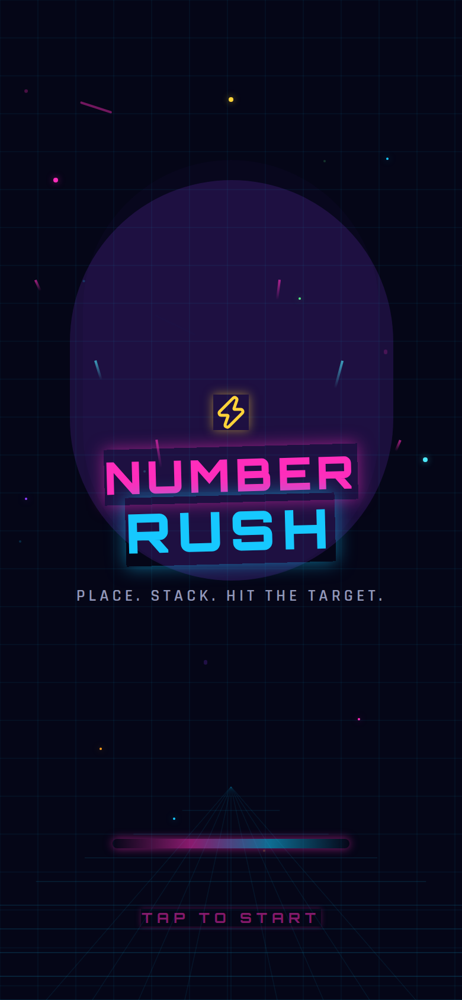
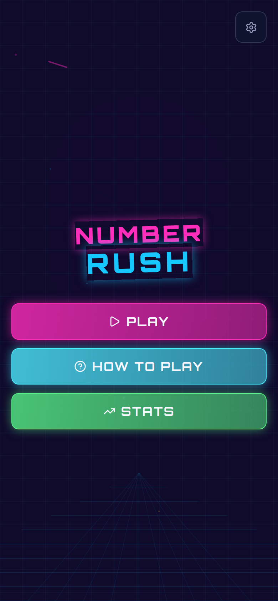
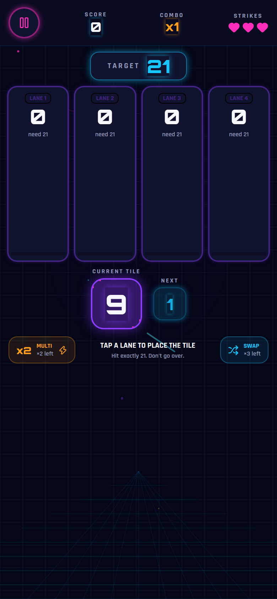
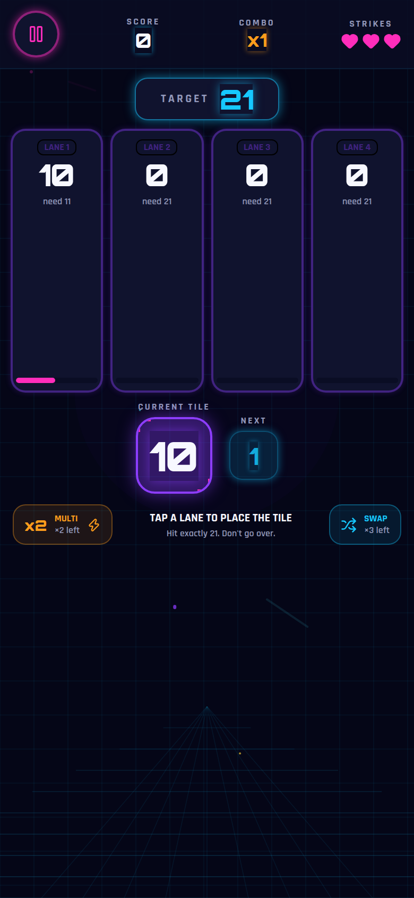
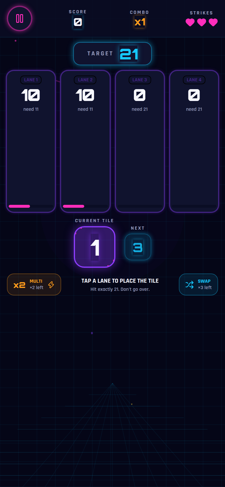
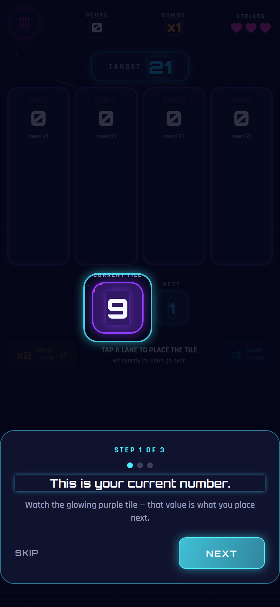
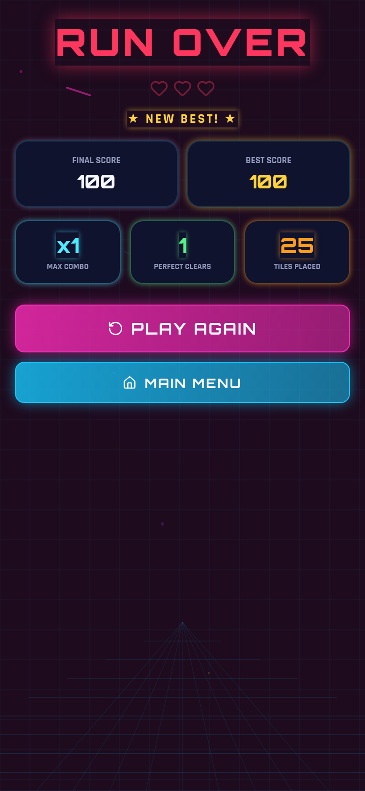
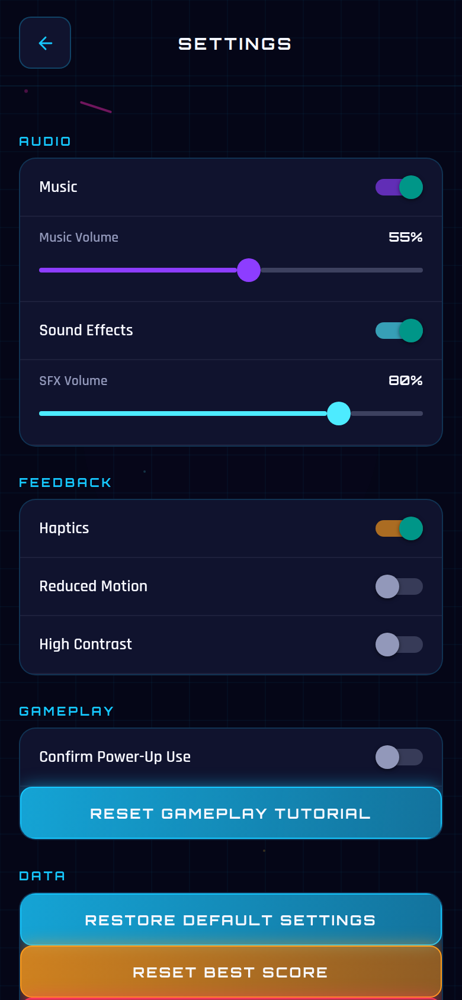

# Number Rush — Neon Number Puzzle Game Template

A polished, playable neon arcade number-puzzle game template built with
**Expo, React Native, and TypeScript**. Stack numbers into lanes, hit exactly
21 for a Perfect clear, chain your combo, and survive three strikes.

This is the **Classic-only sellable template**: a stable, documented,
production-quality starting point for a reusable puzzle game. Backend,
accounts, live leaderboards, and monetization exist in source as disabled
reference architecture — see [`docs/SELLABLE_TEMPLATE_AUDIT.md`](docs/SELLABLE_TEMPLATE_AUDIT.md)
and [`KNOWN_LIMITATIONS.md`](KNOWN_LIMITATIONS.md).

## Screenshots

| Splash | Main Menu | Gameplay | Perfect |
|---|---|---|---|
|  |  |  |  |

| Bust | Tutorial | Game Over | Settings |
|---|---|---|---|
|  |  |  |  |

See [`docs/SCREENSHOT_PLAN.md`](docs/SCREENSHOT_PLAN.md) for how these were captured.

## Feature list

- Animated neon Splash screen (tap to start)
- Main Menu — PLAY, HOW TO PLAY, STATS, SETTINGS
- Fully playable **Classic Rush 21** mode
  - 4 number lanes, current + next tile preview
  - Reach exactly 21 for a Perfect clear
  - Bust when a lane exceeds 21 (3-strike Game Over)
  - Score + combo multiplier (×1 → ×2 → ×3 → ×4)
- **Multiplier** and **Swap** power-ups (cancelable, consume-on-success)
- First-time tutorial with measured-rect spotlight (works across phone sizes)
- Pause / Resume / Restart / Return to Main Menu
- Game Over summary: Final Score, Best Score, Perfect Clears, Highest Combo, Tiles Placed
- Local Stats screen (Best Score, Games Played, Perfect Clears, Tiles Placed, Highest Combo)
- Settings: Music/SFX toggle + volume, Haptics, Reduced Motion, High Contrast, Reset Tutorial, Reset Best Score, Reset All, About
- Local-only persistence (AsyncStorage) — no account required
- Responsive layout (360×800, 390×844, 412×915, and Expo Web)
- Reusable, well-typed TypeScript game engine (`src/game/`)
- Centralized theme tokens (`src/theme/`)
- Lightweight error boundary with safe fallback UI

## Technology stack

- [Expo](https://expo.dev) SDK 57
- React Native 0.86 + React 19
- TypeScript
- React Navigation (native-stack)
- AsyncStorage for local persistence
- Jest + `@testing-library/react-native` for unit tests

## Requirements

- Node.js 18+ (LTS recommended)
- npm
- Expo CLI (via `npx`, no global install required)
- Xcode (for iOS builds/simulator) and/or Android Studio (for Android builds/emulator)

## Quick start

```bash
npm install
npx expo start
```

Press `w` for web, `a` for Android, `i` for iOS — or scan the QR code with
Expo Go for a quick preview (note: full native builds are needed to test
platform-native features beyond Classic gameplay).

## Project structure

```
App.tsx                     — App entry: providers, fonts, error boundary
src/
  config/                   — Environment + TEMPLATE_FEATURES flags
  game/                     — Rush 21 engine, constants, types (pure functions)
  hooks/useNumberRushGame.ts — Gameplay state machine (useReducer)
  screens/                  — Splash, MainMenu, Gameplay, GameOver, Settings, Stats, HowToPlay…
  components/gameplay/      — LaneCard, NumberTile, TutorialOverlay, HUD…
  storage/                  — AsyncStorage helpers (best score, stats, settings)
  audio/, haptics/, settings/, theme/ — Supporting providers and tokens
docs/                        — Audits, guides, and planning documents
assets/                      — Icons, splash, audio (see ASSET_LICENSES.md)
```

See [`DOCUMENTATION.md`](DOCUMENTATION.md) for setup/build steps and
[`CUSTOMIZATION_GUIDE.md`](CUSTOMIZATION_GUIDE.md) for how to reskin this template.

## Supported platforms

- iOS (device + simulator via EAS development/preview builds)
- Android (device + emulator via EAS development/preview builds)
- Web (via `npx expo export --platform web` / `npx expo start --web`)

## Known limitations

See [`KNOWN_LIMITATIONS.md`](KNOWN_LIMITATIONS.md). In short: no backend, no
online accounts, no cloud saves, no live multiplayer, no live leaderboard, no
purchases, no advertisements. Progress is local to the device only.

## License

This source template is provided under the terms in
[`LICENSE_TEMPLATE.md`](LICENSE_TEMPLATE.md) (marketplace license — exact
terms depend on where you obtained it). Third-party asset licenses are listed
in [`ASSET_LICENSES.md`](ASSET_LICENSES.md).
